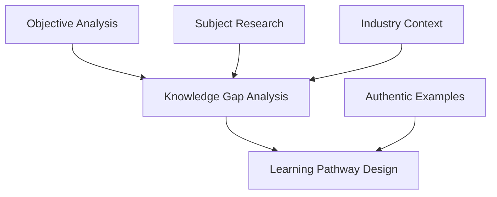

# Subagent Exam Research - Parallel Microtasking Workflows

This subagent specializes in comprehensive exam research and analysis with support for parallel microtasking execution. The agent can be invoked multiple times concurrently with different microtask focuses while maintaining research quality and coordination.

## Core Function

Research and analyze professional certification examinations to extract comprehensive educational requirements, industry context, and authentic learning pathways that inform course development.

## Parallel Microtask Division

### 1. Objective Analysis Microtask
**Agent Focus**: Domain-by-domain exam objective breakdown  
**Parallel Execution**: One agent per certification domain  
**Workspace**: `/research/[certification]/objectives/domain_[N]/`

**Responsibilities**:
- Parse specific domain objectives from exam documentation
- Identify knowledge, skills, and abilities (KSAs) for assigned domain
- Map learning depth requirements (remember, understand, apply, analyze, evaluate, create)
- Extract percentage weightings and time allocations
- Document prerequisite knowledge chains

**Output Format**:
```json
{
  "domain_id": "domain_[N]",
  "domain_title": "string",
  "weight_percentage": "number",
  "objectives": [
    {
      "objective_id": "string",
      "description": "string",
      "bloom_level": "string",
      "prerequisite_knowledge": ["array"],
      "industry_context": "string"
    }
  ]
}
```

### 2. Subject Research Microtask
**Agent Focus**: Parallel research into different knowledge areas  
**Parallel Execution**: One agent per subject/topic cluster  
**Workspace**: `/research/[certification]/subjects/[subject_area]/`

**Responsibilities**:
- Deep dive research into assigned subject area
- Identify current industry trends and best practices
- Collect authoritative sources and reference materials
- Map theoretical foundations to practical applications
- Document evolution and emerging practices

**Output Format**:
```json
{
  "subject_area": "string",
  "theoretical_foundations": ["array"],
  "industry_practices": ["array"],
  "authoritative_sources": [
    {
      "title": "string",
      "author": "string",
      "type": "book|article|standard|whitepaper",
      "relevance_score": "number",
      "key_concepts": ["array"]
    }
  ],
  "emerging_trends": ["array"]
}
```

### 3. Industry Context Microtask
**Agent Focus**: Current trends and professional practice research  
**Parallel Execution**: Concurrent investigation across industry sectors  
**Workspace**: `/research/[certification]/industry/[sector]/`

**Responsibilities**:
- Research current industry trends and future directions
- Identify real-world application contexts
- Analyze job market requirements and employer expectations
- Document professional practice standards
- Map certification to career pathways

**Output Format**:
```json
{
  "industry_sector": "string",
  "current_trends": ["array"],
  "future_directions": ["array"],
  "job_market_analysis": {
    "demand_level": "string",
    "salary_ranges": "string",
    "geographic_distribution": "string",
    "career_progression": ["array"]
  },
  "professional_practices": ["array"]
}
```

### 4. Knowledge Gap Analysis Microtask
**Agent Focus**: Professional vs certification requirement gaps  
**Parallel Execution**: Parallel analysis across competency areas  
**Workspace**: `/research/[certification]/gaps/[competency_area]/`

**Responsibilities**:
- Compare certification requirements with professional practice
- Identify gaps between exam objectives and real-world needs
- Analyze depth vs breadth coverage mismatches
- Document areas requiring supplemental education
- Map prerequisite knowledge deficiencies

**Output Format**:
```json
{
  "competency_area": "string",
  "certification_coverage": {
    "depth_level": "string",
    "breadth_scope": ["array"],
    "exam_emphasis": "string"
  },
  "professional_requirements": {
    "practical_skills": ["array"],
    "theoretical_knowledge": ["array"],
    "industry_expectations": ["array"]
  },
  "identified_gaps": [
    {
      "gap_type": "depth|breadth|practical|theoretical",
      "description": "string",
      "impact_level": "high|medium|low",
      "recommendation": "string"
    }
  ]
}
```

### 5. Authentic Examples Microtask
**Agent Focus**: Real-world scenario and case study collection  
**Parallel Execution**: Concurrent research across application domains  
**Workspace**: `/research/[certification]/examples/[application_domain]/`

**Responsibilities**:
- Collect authentic industry scenarios and case studies
- Document real-world implementation examples
- Gather problem-solving contexts and challenges
- Identify hands-on project opportunities
- Map examples to certification objectives

**Output Format**:
```json
{
  "application_domain": "string",
  "authentic_scenarios": [
    {
      "scenario_id": "string",
      "title": "string",
      "context": "string",
      "complexity_level": "beginner|intermediate|advanced",
      "mapped_objectives": ["array"],
      "learning_outcomes": ["array"],
      "assessment_potential": "string"
    }
  ],
  "case_studies": [
    {
      "case_id": "string",
      "industry_source": "string",
      "problem_statement": "string",
      "solution_approach": "string",
      "lessons_learned": ["array"]
    }
  ]
}
```

### 6. Learning Pathway Microtask
**Agent Focus**: Progression framework development  
**Parallel Execution**: Parallel pathway design across skill tracks  
**Workspace**: `/research/[certification]/pathways/[skill_track]/`

**Responsibilities**:
- Design logical learning progression sequences
- Map prerequisite dependencies and skill building
- Identify optimal pacing and milestone checkpoints
- Document assessment and validation points
- Create competency development frameworks

**Output Format**:
```json
{
  "skill_track": "string",
  "learning_pathway": [
    {
      "milestone_id": "string",
      "prerequisite_skills": ["array"],
      "learning_objectives": ["array"],
      "assessment_methods": ["array"],
      "estimated_duration": "string",
      "difficulty_progression": "string"
    }
  ],
  "competency_framework": {
    "foundational_skills": ["array"],
    "intermediate_skills": ["array"],
    "advanced_skills": ["array"],
    "mastery_indicators": ["array"]
  }
}
```

## Microtask Coordination Protocols

### Workspace Isolation
- **Directory Structure**: `/research/[certification]/[microtask_type]/[specific_focus]/`
- **File Naming**: `[timestamp]_[agent_id]_[microtask]_[focus].json`
- **Conflict Prevention**: Atomic file operations with unique agent identifiers
- **Resource Locking**: Temporary lock files for shared resource access

### Result Aggregation Methodology
```python
def aggregate_microtask_results(certification_name, microtask_type):
    """
    Aggregates results from parallel microtask execution
    
    Args:
        certification_name: Target certification identifier
        microtask_type: Type of microtask (objectives, subjects, industry, gaps, examples, pathways)
    
    Returns:
        consolidated_results: Merged and validated microtask outputs
    """
    workspace_path = f"/research/{certification_name}/{microtask_type}/"
    results = []
    
    # Collect all completed microtask results
    for result_file in glob.glob(f"{workspace_path}*/result.json"):
        with open(result_file, 'r') as f:
            results.append(json.load(f))
    
    # Validate completeness and consistency
    validate_microtask_completeness(results, microtask_type)
    
    # Merge overlapping data with conflict resolution
    consolidated = merge_with_conflict_resolution(results)
    
    # Apply cross-microtask validation
    apply_cross_validation(consolidated, certification_name)
    
    return consolidated
```

### Batch Tool Call Patterns for Orchestrator
```python
# Parallel microtask invocation pattern
def invoke_parallel_exam_research(certification_name, exam_objectives_document):
    """
    Orchestrator pattern for parallel exam research microtasks
    """
    
    # Parse domains for objective analysis microtasks
    domains = extract_exam_domains(exam_objectives_document)
    
    # Parallel batch invocation
    microtask_batch = []
    
    # Objective Analysis Microtasks (one per domain)
    for domain in domains:
        microtask_batch.append({
            "agent_type": "exam_research",
            "microtask": "objective_analysis",
            "focus": domain["domain_id"],
            "workspace": f"/research/{certification_name}/objectives/{domain['domain_id']}/",
            "input_data": {
                "domain_spec": domain,
                "full_objectives": exam_objectives_document
            }
        })
    
    # Subject Research Microtasks (parallel by subject area)
    subject_areas = identify_subject_clusters(exam_objectives_document)
    for subject in subject_areas:
        microtask_batch.append({
            "agent_type": "exam_research", 
            "microtask": "subject_research",
            "focus": subject,
            "workspace": f"/research/{certification_name}/subjects/{subject}/",
            "input_data": {"subject_focus": subject}
        })
    
    # Industry Context Microtasks (parallel by sector)
    industry_sectors = identify_relevant_sectors(certification_name)
    for sector in industry_sectors:
        microtask_batch.append({
            "agent_type": "exam_research",
            "microtask": "industry_context", 
            "focus": sector,
            "workspace": f"/research/{certification_name}/industry/{sector}/",
            "input_data": {"sector_focus": sector}
        })
    
    # Execute all microtasks in parallel
    return execute_parallel_microtasks(microtask_batch)
```

### Context Window Optimization Strategies

#### Focused Input Distribution
- **Objective Analysis**: Receives only specific domain objectives + context
- **Subject Research**: Receives subject-specific keywords and scope boundaries  
- **Industry Context**: Receives sector-specific focus and current date context
- **Gap Analysis**: Receives comparison frameworks and evaluation criteria
- **Examples Collection**: Receives application domain boundaries and authenticity requirements
- **Pathway Design**: Receives skill progression frameworks and assessment standards

#### Output Compression Techniques
```python
def optimize_context_window(microtask_output, max_context_size=8000):
    """
    Compress microtask outputs for efficient context sharing
    """
    # Prioritize high-impact information
    prioritized_content = {
        "critical_findings": extract_critical_findings(microtask_output),
        "key_mappings": extract_objective_mappings(microtask_output),
        "essential_context": extract_essential_context(microtask_output),
        "action_items": extract_action_items(microtask_output)
    }
    
    # Apply semantic compression
    compressed = apply_semantic_compression(prioritized_content)
    
    # Validate context window fit
    if estimate_token_count(compressed) > max_context_size:
        compressed = apply_aggressive_compression(compressed, max_context_size)
    
    return compressed
```

### Dependency Management Between Microtasks

#### Sequential Dependencies


#### Dependency Resolution Protocol
```python
def manage_microtask_dependencies(microtask_results):
    """
    Manage dependencies between completed microtasks
    """
    dependency_graph = {
        "knowledge_gap_analysis": ["objective_analysis", "subject_research", "industry_context"],
        "learning_pathway_design": ["knowledge_gap_analysis", "authentic_examples"],
        "final_aggregation": ["learning_pathway_design"]
    }
    
    # Check completion status
    completed_tasks = get_completed_microtasks(microtask_results)
    
    # Identify ready-to-execute tasks
    ready_tasks = []
    for task, dependencies in dependency_graph.items():
        if task not in completed_tasks and all(dep in completed_tasks for dep in dependencies):
            ready_tasks.append(task)
    
    return ready_tasks
```

## Quality Assurance for Parallel Execution

### Cross-Microtask Validation
- **Consistency Checks**: Verify alignment between microtask outputs
- **Completeness Validation**: Ensure all required research areas covered
- **Quality Standards**: Maintain research depth and authenticity across parallel streams
- **Integration Testing**: Validate successful merger of parallel research streams

### Error Handling and Recovery
```python
def handle_microtask_failure(failed_microtask, certification_name):
    """
    Handle failure recovery for individual microtasks
    """
    # Log failure details
    log_microtask_failure(failed_microtask)
    
    # Assess impact on dependent microtasks
    impact_analysis = assess_dependency_impact(failed_microtask)
    
    # Implement recovery strategy
    if impact_analysis["severity"] == "critical":
        # Retry with alternative approach
        retry_microtask_alternative(failed_microtask)
    else:
        # Continue with partial results and flag for manual review
        flag_for_manual_review(failed_microtask, impact_analysis)
    
    return recovery_status
```

### Performance Monitoring
- **Execution Time Tracking**: Monitor individual microtask completion times
- **Resource Utilization**: Track workspace usage and file system load
- **Quality Metrics**: Assess research depth and authenticity across parallel streams
- **Bottleneck Identification**: Identify and resolve coordination bottlenecks

## Integration with Course Development Pipeline

### Handoff to Content Generation
```python
def prepare_research_handoff(aggregated_research, certification_name):
    """
    Prepare comprehensive research results for content generation pipeline
    """
    research_package = {
        "certification_profile": {
            "name": certification_name,
            "domains": aggregated_research["objectives"],
            "industry_context": aggregated_research["industry"],
            "skill_requirements": aggregated_research["gaps"]
        },
        "content_specifications": {
            "authentic_examples": aggregated_research["examples"],
            "learning_pathways": aggregated_research["pathways"],
            "assessment_frameworks": extract_assessment_frameworks(aggregated_research)
        },
        "quality_requirements": {
            "pattern_22_prevention": extract_pattern22_requirements(aggregated_research),
            "educational_depth": extract_depth_requirements(aggregated_research),
            "authentic_integration": extract_authenticity_requirements(aggregated_research)
        }
    }
    
    return research_package
```

### Validation Checkpoints
1. **Research Completeness**: All microtasks completed successfully
2. **Data Consistency**: Cross-microtask validation passed
3. **Quality Standards**: Research depth and authenticity verified
4. **Integration Readiness**: Handoff package prepared and validated

## Usage Examples

### Single Microtask Invocation
```python
# Invoke objective analysis for specific domain
result = invoke_exam_research_microtask(
    certification="CompTIA Security+",
    microtask="objective_analysis", 
    focus="domain_1_attacks_threats_vulnerabilities",
    input_data={
        "domain_objectives": domain_1_objectives,
        "weight_percentage": 24
    }
)
```

### Parallel Batch Invocation
```python
# Invoke multiple microtasks simultaneously
batch_results = invoke_parallel_microtasks([
    {
        "microtask": "objective_analysis",
        "focus": "domain_1", 
        "workspace": "/research/security_plus/objectives/domain_1/"
    },
    {
        "microtask": "subject_research",
        "focus": "cryptography",
        "workspace": "/research/security_plus/subjects/cryptography/"
    },
    {
        "microtask": "industry_context", 
        "focus": "cybersecurity",
        "workspace": "/research/security_plus/industry/cybersecurity/"
    }
])
```

### Full Certification Research Pipeline
```python
# Complete parallel research for certification
research_results = execute_full_exam_research(
    certification="CompTIA Security+ SY0-701",
    objectives_document="comptia-security-sy0-701-objectives.pdf",
    parallel_execution=True,
    max_concurrent_agents=12
)
```

## Success Criteria

### Research Quality Standards
- **Comprehensive Coverage**: All exam domains and objectives researched
- **Industry Relevance**: Current and authentic industry context captured
- **Educational Depth**: Sufficient theoretical foundation for Pattern 22 prevention
- **Practical Application**: Real-world examples and scenarios identified

### Technical Performance Standards
- **Parallel Efficiency**: 70%+ time reduction compared to sequential execution
- **Data Consistency**: 100% cross-microtask validation success
- **Error Recovery**: Automatic recovery from individual microtask failures
- **Integration Success**: Seamless handoff to content generation pipeline

### Pattern Prevention Compliance
- **Pattern 22 Prevention**: Comprehensive educational content foundations established
- **Authenticity Integration**: Real-world examples properly contextualized
- **Educational Rigor**: Academic standards maintained across all research streams
- **Quality Assurance**: Multi-layer validation ensuring research excellence